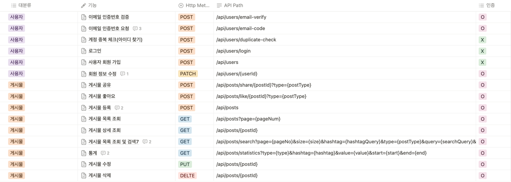
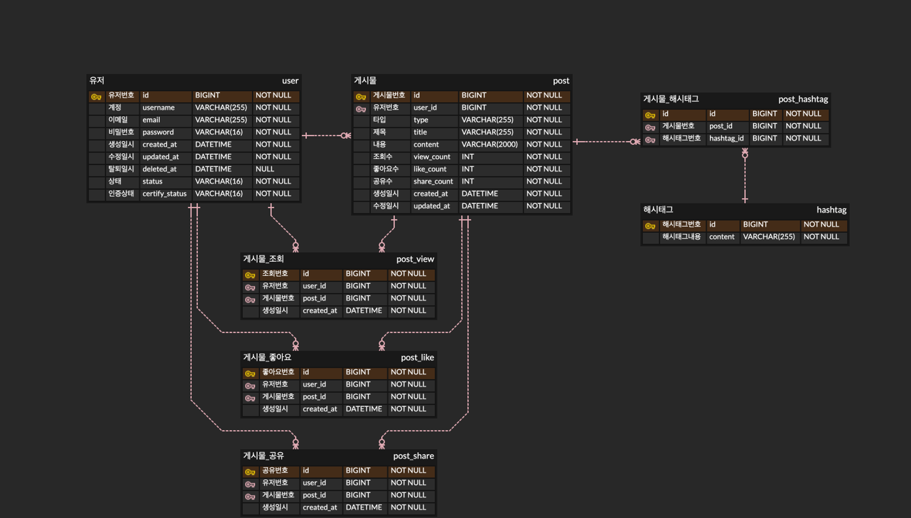
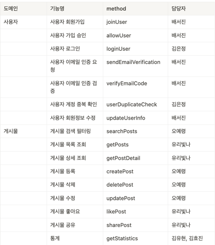
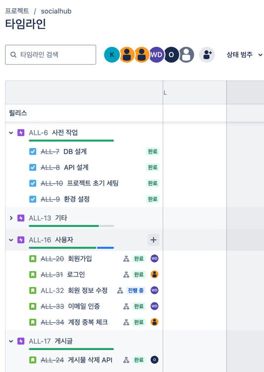

# Socialhub

## 서비스 소개

해시태그를 기반으로 `인스타그램`, `스레드`, `페이스북`, `트위터(X)` 등
복수의 SNS에 게시된 게시물 중 해시태그가 포함된 게시물들을 하나의 서비스에서 확인할 수 있는
**통합 Feed 어플리케이션의 API 서버**입니다.

### 주요 기능

- 유저는 계정(추후 해시태그로 관리), 비밀번호, 이메일로 **가입요청**을 진행합니다.
- 가입 요청 시, 이메일로 발송된 코드를 입력하여 **가입승인**을 받고 서비스 이용이 가능합니다.
- 서비스 로그인 시, 메뉴는 **통합 Feed** 단일 입니다. ****
- 통합 Feed 에선  `인스타그램`, `스레드`, `페이스북`, `트위터` 에서 유저의 계정이 태그된 글들을 확인합니다.
- 또는, 특정 해시태그(1건)를 입력하여, 해당 해시태그가 포함된 게시물들을 확인합니다.
- 유저는 본인 계정명 또는 특정 해시태그 일자별, 시간별 게시물 갯수 통계를 확인할 수 있습니다.
- 유저는 하나의 채널로 유저(ex. `#dani`), 또는 브랜드(ex. `#danishop`) 의 SNS 노출 게시물 및 통계를 확인할 수 있습니다.

### 프로젝트 환경

- Spring boot 3.3.x
- Gradle 8.8
- JDK 17
- MySQL 8.0
- Redis 6.0

### API 명세서



### ERD



## 트러블 슈팅

### JWT 토큰 시크릿 키 보안 오류

JWT 토큰 발행을 위한 Secret Key 설정 중에 발생

발생한 문제(에러)

해당 에러 발생
`io.jsonwebtoken.security.WeakKeyException`

**원인**

(추정되는 원인)

오류 제목을 보고 보안이 약한 Secret Key를 설정했기 때문이라고 생각

(실제 원인)

Secret Key를 256bite 미만으로 설정했기 때문에 발생

해결방법

Secret Key를 좀 더 길게 설정

**참고자료**

https://green-bin.tistory.com/49

### Enum의 유효성 검사 및 예외처리

<aside>
🔥 **문제 상황**

- 어떤 것을 하려다가 문제가 발생했는가?

쿼리 파라미터가 길고 복잡하여 DTO로 생성하였다.

추가로 잘못된 Enum 값이 들어올 경우, 해당 타입에 따라서 원하는 에러 코드를 던지고 싶었다.

- 발생한 문제(에러)

어떤 Enum값이든 상관없이 유효하지 않은 타입이 왔을 떄 BindException을 던져서 언제 어느 타입이 유효하지 않은지 메세지를 정확히 주기 어려웠다.

- **원인**

DTO에서 들어올 때, @ModelAttribute에서 타입이 맞지 않으면 BindException을 내기 떄문이었다.

- **최종 해결**
    - 해결방법

```java

@ExceptionHandler(value = {BindException.class})
protected ResponseEntity<ErrorResponse> handleBindException(BindException ex, HandlerMethod handlerMethod) {

    log.error("handleBindException", ex);

    FieldError fieldError = ex.getFieldError();
    String fieldName = fieldError.getField();
    Object rejectedValue = fieldError.getRejectedValue();

    String errorMessage = switch (fieldName) {
        case "type" -> ErrorCode.STATISTICS_INVALID_TYPE.getMessage();
        case "value" -> ErrorCode.STATISTICS_INVALID_VALUE.getMessage();
        case "start", "end" -> ErrorCode.STATISTICS_INVALID_DATE.getMessage();
        default -> fieldError.getDefaultMessage();
    };

    ErrorResponse response = ErrorResponse.create()
            .message(errorMessage)
            .httpStatus(HttpStatus.BAD_REQUEST);

    return ResponseEntity.badRequest().body(response);
}
```

우선 Global Exception Handler에서 파라미터명에 따라서 에러 코드를 매핑해주었다.

다만, 다른 메서드에서도 동일한 파라미터명이 들어올 수 있기 때문에 이를 처리해야한다.

- 개선 방안

컨트롤러나 메소드 명에 따라서, 의도한 에러코드를 낼 수 있도록 수정하거나

커스텀 어노테이션을 만들어 Enum을 유효성 검사할 수 있도록 해야겠다.
https://cchoimin.tistory.com/entry/Enum-유효성-검사하기
https://tommykim.tistory.com/20

**참고자료**

https://velog.io/@dnwlsrla40/Spring-RequestParam으로-QueryParameter를-받는-3가지-방법
https://galid1.tistory.com/769

</aside>

### 목(Mock) 객체 사용 및 테스트 코드 이해 부족

- 각 도메인별 Controller&Service Test 코드 작성 시,
  목(mock) 객체에 대한 이해와 given/when/then별 사용하는 메서드 지식이 부족하였습니다.

1. **어떤 것을 하려다가 문제가 발생했는가?**

```java
1.JwtTokenProvider mockJwtTokenProvider = mock(JwtTokenProvider.class);
2.mockJwtTokenProvider.

createToken();
```

의 차이를 이해하지 못했습니다.

1. **발생한 문제(에러)**

- extractEmail이나 extractAllClaims 등의 모킹이 제대로 설정되지 않음
- 이메일을 추출하는 과정에서 null 반환

2. **원인**

   **3-1. 추정되는 원인**

- 실제 로그인한 유저의 token을 받아와야 한다고 생각
- 어노테이션의 설정 오류라고 생각
    - @Mock, @MockBean, @AutoConfigureMockMvc

**3-2. 실제 원인**

- 실제 로직 vs 모킹된 로직
    - 1번은 해당 클래스의 메서드를 가짜로 구현하여 실제로 아무런 로직을 수행하지 않고, 반환할 값이나 예외를 지정할 수 있습니다.
    - 2번은 실제 로직을 실행합니다.

  ```java
  1. JwtTokenProvider mockJwtTokenProvider = mock(JwtTokenProvider.class);
  - 실제로 JwtTokenProvider의 모든 메서드를 실제 구현 없이 스터빙(stubbing)할 수 있는 목 객체를 생성
  - 이 객체는 JwtTokenProvider 클래스의 인스턴스처럼 동작하지만, 실제 로직은 수행되지 않는다.
  
  ```

3. 해결 방법

- 실제의 JWT 토큰 생성이 테스트에서 중요한 부분이라면, jwtTokenProvider

## 협업 및 커뮤니케이션

### Notion


- 요구사항 정의서 정리



- R&R
    - 오예령(팀장) : 게시물 기능 구현(등록, 수정, 삭제, 검색)
    - 김유현 : 통계 기능 구현 (서비스 및 컨트롤러, 단위 테스트)
    - 김은정 : 사용자 기능 구현 (로그인, 계정 중복 확인)
    - 김효진 :  통계 기능 구현 (서비스 및 레포지토리, 스웨거)
    - 배서진 : 사용자 기능 구현 (회원가입, 이메일 인증 요청&검증)
    - 유리빛나 : 게시물 기능 구현 (목록 조회, 상세 조회, 좋아요, 공유)


- Issue & Jira 를 통한 트래킹 일정 관리




### Discord 이용한한 소통 및 PR 알림 봇


