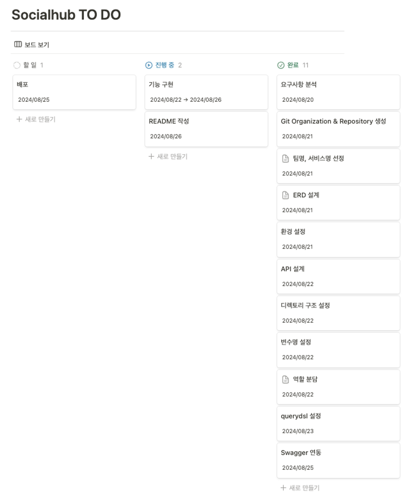
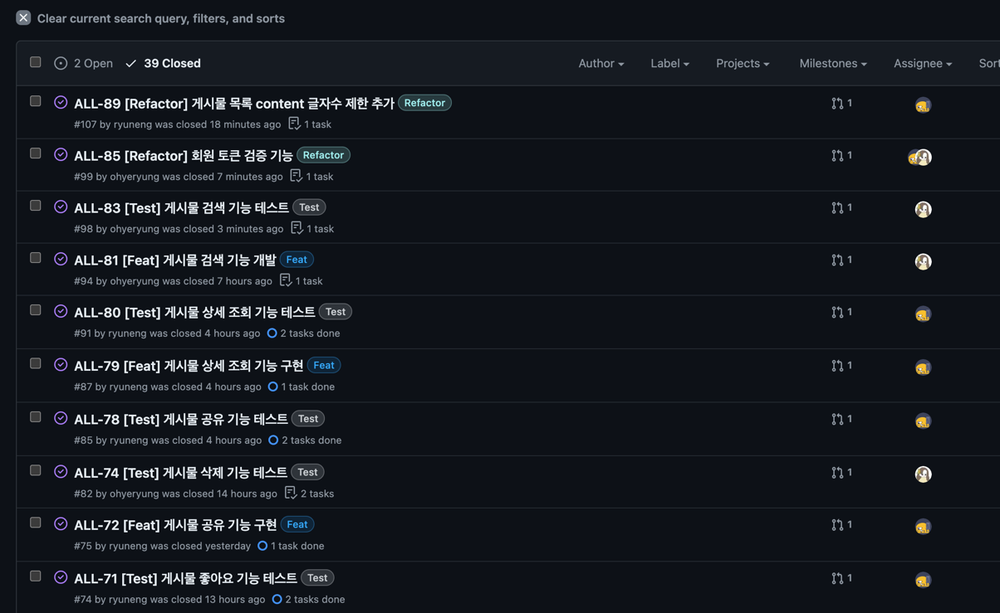
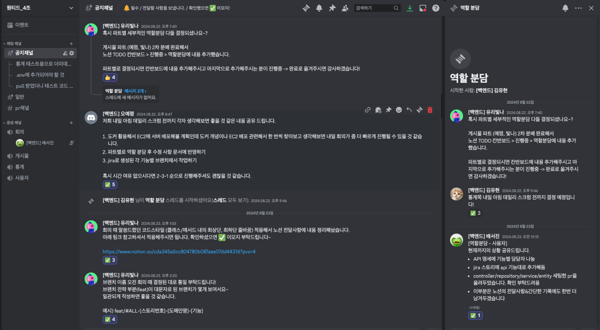
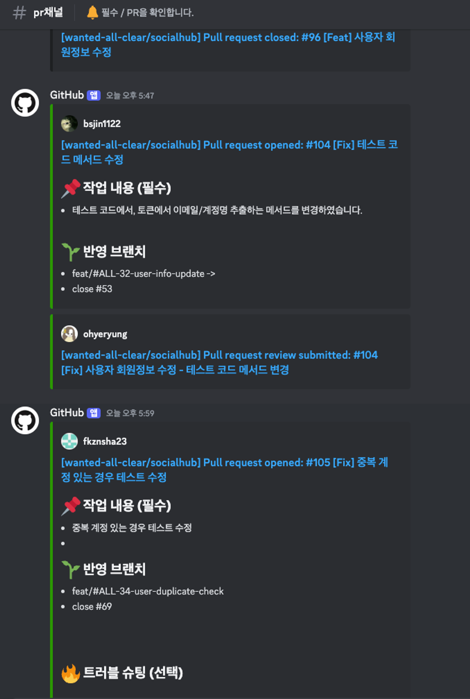

# SocialHub

> ## 📝 목차
> 1. [서비스 소개](#서비스-소개)
> 2. [주요 기능](#주요-기능)
> 3. [R&R](#rr)
> 4. [프로젝트 일정](#프로젝트-일정)
> 5. [Github Issue & Jira 를 통한 Task 트래킹 관리 (WBS)](#github-issue--jira-를-통한-task-트래킹-관리-wbs)
> 6. [Discord 이용한 소통 및 PR 알림 봇](#discord-이용한-소통-및-pr-알림-봇)
> 7. [협업 및 커뮤니케이션](#협업-및-커뮤니케이션)
>   - [Notion](#notion)
> 8. [프로젝트 환경](#프로젝트-환경)
> 9. [기술 선택 이유](#기술-선택-이유)
> 10. [요구사항 정의서 정리](#요구사항-정의서-정리)
> 11. [API 명세서](#api-명세서)
> 12. [ERD](#erd)
> 13. [트러블 슈팅](#트러블-슈팅)
> 14. [디렉토리 구조](#디렉토리-구조)


<br/>

## 서비스 소개

해시태그를 기반으로 `인스타그램`, `스레드`, `페이스북`, `트위터(X)` 등
복수의 SNS에 게시된 게시물 중 해시태그가 포함된 게시물들을 하나의 서비스에서 확인할 수 있는
**통합 Feed 어플리케이션의 API 서버**입니다.

### 주요 기능

> 1. 유저는 계정(추후 해시태그로 관리), 비밀번호, 이메일로 **가입요청**을 진행합니다.
> 2. 가입 요청 시, 이메일로 발송된 코드를 입력하여 **가입승인**을 받고 서비스 이용이 가능합니다.
> 3. 서비스 로그인 시, 메뉴는 **통합 Feed** 단일 입니다. 
> 4. 통합 Feed 에선  `인스타그램`, `스레드`, `페이스북`, `트위터` 에서 유저의 계정이 태그된 글들을 확인합니다.
> 5. 또는, 특정 해시태그(1건)를 입력하여, 해당 해시태그가 포함된 게시물들을 확인합니다.
> 6. 유저는 본인 계정명 또는 특정 해시태그 일자별, 시간별 게시물 갯수 통계를 확인할 수 있습니다.
> 7. 유저는 하나의 채널로 유저(ex. `#dani`), 또는 브랜드(ex. `#danishop`) 의 SNS 노출 게시물 및 통계를 확인할 수 있습니다.

<br/>

### 👩🏻‍💻 R&R
| 담당자       | 담당 업무                                                 |
|:--------------:|----------------------------------------------------------|
| [오예령(팀장)](https://github.com/ohyeryung) | 게시물 기능 구현 (등록, 수정, 삭제, 검색)                  |
| [유리빛나](https://github.com/ryuneng)     | 게시물 기능 구현 (목록 조회, 상세 조회, 좋아요, 공유)       |
| [김유현](https://github.com/youhyeoneee)       | 통계 기능 구현 (서비스 및 컨트롤러, 단위 테스트)           |
| [김은정](https://github.com/fkznsha23)| 사용자 기능 구현 (로그인, 계정 중복 확인)                  |
| [김효진](https://github.com/hyojin52)       | 통계 기능 구현 (서비스 및 레포지토리, 스웨거)              |
| [배서진](https://github.com/bsjin1122)       | 사용자 기능 구현 (회원가입, 이메일 인증, 회원정보 수정)         |

<br>

### 프로젝트 일정
<details>
    <summary><b>프로젝트 과정 타임라인🗓</b></summary>
    - 프로젝트 기간: 2024.08.20 ~ 2024.08.26
    
</details>

<br>

### 협업 및 커뮤니케이션 🗣️ 

<details>
<summary>문서화 작업</summary>
<div markdown="1">
<figure class="half">  
    <a href="link"></a>  
    <a href="link"></a>  
</figure>

</div>
</details>

<br/>

### Github Issue & Jira 를 통한 Task 트래킹 관리 (WBS) 🏃‍♀️‍➡️ 

<details>
<summary>개발일정 관리</summary>
<div markdown="1">



<p align="center">
      
      
</p>

</div>
</details>

<br/>

### Discord을 활용한 소통 및 PR 알림 봇 🤖 

<details>
<summary>소통 및 PR 알림 확인</summary>
<div markdown="1">




</div>
</details>

<br/>

## 프로젝트 환경

| Stack                                                                | Version            |
|:----------------------------------------------------------------------:|:-----------------:|
|   | Spring Boot 3.3.x |
|     | Gradle 8.8       |
|     | JDK 17           |
|        | MySQL 8.0        |
|     | Redis 6.0        |

<br/>

## 기술 선택 이유

<details>
  <summary><b>JWT 토큰을 사용한 이유😏</b></summary>

 #### 1. 뛰어난 보안성

- 기본적으로 JWT 토큰은 `헤더와 페이로드`를 합친 후 `비밀 키`를 이용해 생성되기 때문에 무결성을 검증할 수 있으며, 
- 비밀 키는 `256byte 미만으로 설정하면 오류`가 발생  

#### 2. State-less
- 서버 세션에 저장되는 것이 아니기 때문에 `세션을 무상태로 유지`

#### 3. DB에 독립적
- JWT 토큰은 DB에 저장되는 것이 아니기 때문에 `매 인증마다 쿼리를 실행할 필요가 없음`
</details>
<p></p>
<details>
  <summary><b>Redis를 사용한 이유😜</b></summary>

#### 1. 빠른 성능💨
- 메모리 기반 저장소로 이메일 인증 코드의 `빠른 읽기/쓰기`가 가능
  
#### 2. 자동 만료 관리
- TTL(Time to Live) 기능으로 인증 코드의 `유효 기간을 자동으로 관리`할 수 있음. 

#### 3. 무상태 유지
- 세션 없이 인증 상태를 관리할 수 있어, `서버 확장성에 유리`함

#### 4. 분산 처리 용이
- 여러 서버에서 중앙 집중형으로 인증 코드를 관리할 수 있음
    > - 분산 시스템에서는 여러 대의 서버가 서로 협력하여 작업을 처리합니다. 
     > - 이때 각 서버가 사용자의 요청을 처리하는데 필요한 인증 코드나 세션 데이터를 공유해야 하는 경우가 있습니다. 
     > - Redis는 네트워크 상에서 쉽게 접근할 수 있는 중앙 집중형 데이터 저장소 역할을 하여, 모든 서버가 동일한 Redis 인스턴스에 접근해 인증 코드를 저장하거나 조회할 수 있게 합니다.
</details>

<br>

### 요구사항 정의서 정리

| 도메인 | 기능명               | Controller & Service method   | 담당자        |
|--------|----------------------|-------------------------|---------------|
| 사용자 | 사용자 회원가입        | joinUser                | [배서진](https://github.com/bsjin1122)        |
| 사용자 | 사용자 로그인         | loginUser               | [김은정](https://github.com/fkznsha23)        |
| 사용자 | 사용자 이메일 인증 요청 | sendEmailVerification    | [배서진](https://github.com/bsjin1122)        |
| 사용자 | 사용자 이메일 인증 검증 | verifyEmailCode         | [배서진](https://github.com/bsjin1122)        |
| 사용자 | 사용자 계정 중복 확인  | userDuplicateCheck      | [김은정](https://github.com/fkznsha23)        |
| 사용자 | 사용자 회원정보 수정   | updateUserInfo          | [배서진](https://github.com/bsjin1122)        |
| 게시물 | 게시물 검색 필터링     | searchPosts             | [오예령](https://github.com/ohyeryung)        |
| 게시물 | 게시물 목록 조회      | getPosts                | [유리빛나](https://github.com/ryuneng)        |
| 게시물 | 게시물 상세 조회      | getPostDetail           | [유리빛나](https://github.com/ryuneng)        |
| 게시물 | 게시물 등록           | createPost              | [오예령](https://github.com/ohyeryung)        |
| 게시물 | 게시물 삭제           | deletePost              | [오예령](https://github.com/ohyeryung)        |
| 게시물 | 게시물 수정           | updatePost              | [오예령](https://github.com/ohyeryung)        |
| 게시물 | 게시물 좋아요         | likePost                | [유리빛나](https://github.com/ryuneng)        |
| 게시물 | 게시물 공유           | sharePost               | [유리빛나](https://github.com/ryuneng)        |
| 통계   | 통계                  | getStatistics           | [김유현](https://github.com/youhyeoneee), [김효진](https://github.com/hyojin52) |

<br/>

### [API 명세서](https://documenter.getpostman.com/view/20456478/2sAXjGcDg4)

 > 자세한 명세는 API 명세서(Postman)를 클릭해 확인 해주세요!

| 도메인 | 기능명               | Http Method | API Path                       | 인증 | 담당자        |
|--------|----------------------|-------------|--------------------------------|------|---------------|
| 사용자 | 사용자 회원가입        | `POST`        | /api/users                     | `X`    | [배서진](https://github.com/bsjin1122)        |
| 사용자 | 사용자 로그인         | `POST`       | /api/users/login               | `X`    | [김은정](https://github.com/fkznsha23)        |
| 사용자 | 사용자 이메일 인증 요청 | `POST`        | /api/users/email-verification  | `O`    | [배서진](https://github.com/bsjin1122)        |
| 사용자 | 사용자 이메일 인증 검증 | `POST`        | /api/users/email-verification  | `O`    | [배서진](https://github.com/bsjin1122)        |
| 사용자 | 사용자 계정 중복 확인  | `POST`        | /api/users/duplicate-check     | `X`    | [김은정](https://github.com/fkznsha23)        |
| 사용자 | 사용자 회원정보 수정   | `PATCH`       | /api/users                     | `O`    | [배서진](https://github.com/bsjin1122)        |
| 게시물 | 게시물 검색 필터링     | `GET`         | /api/posts/search              | `O`    | [오예령](https://github.com/ohyeryung)        |
| 게시물 | 게시물 목록 조회      | `GET`         | /api/posts                     | `O`    | [유리빛나](https://github.com/ryuneng)        |
| 게시물 | 게시물 상세 조회      | `GET`         | /api/posts/{postId}            | `O`    | [유리빛나](https://github.com/ryuneng)        |
| 게시물 | 게시물 등록           | `POST`        | /api/posts                     | `O`    | [오예령](https://github.com/ohyeryung)        |
| 게시물 | 게시물 삭제           | `DELETE`      | /api/posts/{postId}            | `O`    | [오예령](https://github.com/ohyeryung)        |
| 게시물 | 게시물 수정           | `PUT`         | /api/posts/{postId}            | `O`    | [오예령](https://github.com/ohyeryung)        |
| 게시물 | 게시물 좋아요         | `POST`        | /api/posts/{postId}/like       | `O`    | [유리빛나](https://github.com/ryuneng)        |
| 게시물 | 게시물 공유           | `POST`        | /api/posts/{postId}/share      | `O`    | [유리빛나](https://github.com/ryuneng)        |
| 통계   | 통계                  | `GET`         | /api/statistics                | `O`    | [김유현](https://github.com/youhyeoneee), [김효진](https://github.com/hyojin52) |


<br>

### ERD


<p></p>

<details>
  <summary><b>🧐 1. 게시물 조회 테이블의 필요성</b></summary>

>**배경** : 일자별 조회수 통계 API 구현 시, 조회가 발생한 날짜 데이터가 필요합니다.

>**분석** : 게시물 테이블 내에 있는 조회수 컬럼만으로는 언제 조회가 발생한 건지 알 수 없습니다.

>**결과** : 조회가 발생한 날짜를 기록할 수 있는 별도의 조회 테이블이 필요하다고 판단하여 생성하였습니다.
</details>

<details>
  <summary> <b>😎 2. 게시물 테이블의 조회수 / 좋아요수 / 공유수 컬럼 </b></summary>

>**배경**: 게시물 목록 API의 정렬 기능에서 조회수 데이터가 필요합니다.
  
>**분석**: 별도의 테이블과 Join하여 조회하는 것보다 post 테이블 자체에서 조회하는 것이 성능의 부하를 줄일 수 있다고 판단하였습니다.
  
>**결과**: 위와 같은 판단 하에 post 테이블 내에 그대로 두었으나, 더 나은 방향이 있을 시 수정 예정입니다.
</details>

<br>

## 트러블 슈팅
- [💥 **1. JWT 토큰 시크릿 키 보안 오류**](https://github.com/wanted-all-clear/socialhub/blob/dev/readme/trouble/JWT_%ED%86%A0%ED%81%B0_%EC%8B%9C%ED%81%AC%EB%A6%BF_%ED%82%A4_%EB%B3%B4%EC%95%88_%EC%98%A4%EB%A5%98.md)  

<p></p>

- [🤔 **2. MultiValueMap으로 인한 415 UNSUPPORTED_MEDIA_TYPE 오류**](https://github.com/wanted-all-clear/socialhub/blob/dev/readme/trouble/MultiValueMap_415_ERROR.md)

<p></p>

- [💦 **3. Querydsl 설정 관련 이슈**](https://github.com/wanted-all-clear/socialhub/blob/dev/readme/trouble/Querydsl_%EC%84%A4%EC%A0%95_%EA%B4%80%EB%A0%A8_%EC%9D%B4%EC%8A%88.md)
<p></p>

- [🔥 **4. Enum의 유효성 검사 및 예외처리**](https://github.com/wanted-all-clear/socialhub/blob/dev/readme/trouble/Enum%EC%9D%98_%EC%9C%A0%ED%9A%A8%EC%84%B1_%EA%B2%80%EC%82%AC_%EB%B0%8F_%EC%98%88%EC%99%B8%EC%B2%98%EB%A6%AC.md)

<p></p>

- [😅 **5. 목(Mock) 객체 사용 및 테스트 코드 작성에 어려움**](https://github.com/wanted-all-clear/socialhub/blob/dev/readme/trouble/%EB%AA%A9(Mock)_%EA%B0%9D%EC%B2%B4_%EC%82%AC%EC%9A%A9_%EB%B0%8F_%ED%85%8C%EC%8A%A4%ED%8A%B8_%EC%BD%94%EB%93%9C_%EC%9E%91%EC%84%B1_%EC%9D%B4%ED%95%B4_%EB%B6%80%EC%A1%B1.md)
<br>

## 디렉토리 구조
<details><summary>디렉토리 구조</summary>

```text
C:.
│   .env
│   .gitignore
│   build.gradle
│   docker-compose.yml
│   settings.gradle
├───.github
│   ├───ISSUE_TEMPLATE
│   └───workflows
├───build
└───src
    ├───main
    │   ├───java
    │   │   └───com
    │   │       └───allclear
    │   │           └───socialhub
    │   │               ├───common
    │   │               ├───post
    │   │               └───user
    │   └───resources
    └───test
        ├───java
        │   └───com
        │       └───allclear
        │           └───socialhub
        └───resources
```

<br>
    
```text
📦socialhub
 ┣ 📂common
 ┃ ┣ 📂config
 ┃ ┃ ┣ 📜ConverterConfig.java
 ┃ ┃ ┣ 📜JpaConfig.java
 ┃ ┃ ┣ 📜RedisConfig.java
 ┃ ┃ ┣ 📜SwaggerConfig.java
 ┃ ┃ ┗ 📜WebSecurityConfig.java
 ┃ ┣ 📂converter
 ┃ ┃ ┣ 📜StringToStatisticTypeConverter.java
 ┃ ┃ ┗ 📜StringToStatisticValueConverter.java
 ┃ ┣ 📂domain
 ┃ ┃ ┗ 📜Timestamped.java
 ┃ ┣ 📂exception
 ┃ ┃ ┣ 📂handler
 ┃ ┃ ┃ ┗ 📜GlobalExceptionHandler.java
 ┃ ┃ ┣ 📜CustomException.java
 ┃ ┃ ┣ 📜ErrorCode.java
 ┃ ┃ ┗ 📜ErrorResponse.java
 ┃ ┣ 📂provider
 ┃ ┃ ┗ 📜JwtTokenProvider.java
 ┃ ┗ 📂util
 ┃ ┃ ┣ 📜DateUtil.java
 ┃ ┃ ┗ 📜TokenUtil.java
 ┣ 📂post
 ┃ ┣ 📂common
 ┃ ┃ ┣ 📂hashtag
 ┃ ┃ ┃ ┣ 📂domain
 ┃ ┃ ┃ ┃ ┣ 📜Hashtag.java
 ┃ ┃ ┃ ┃ ┗ 📜PostHashtag.java
 ┃ ┃ ┃ ┣ 📂repository
 ┃ ┃ ┃ ┃ ┣ 📜HashtagRepository.java
 ┃ ┃ ┃ ┃ ┗ 📜PostHashtagRepository.java
 ┃ ┃ ┃ ┗ 📂service
 ┃ ┃ ┃ ┃ ┣ 📜HashtagService.java
 ┃ ┃ ┃ ┃ ┗ 📜HashtagServiceImpl.java
 ┃ ┃ ┣ 📂like
 ┃ ┃ ┃ ┣ 📂domain
 ┃ ┃ ┃ ┃ ┗ 📜PostLike.java
 ┃ ┃ ┃ ┣ 📂dto
 ┃ ┃ ┃ ┃ ┗ 📜PostLikeResponse.java
 ┃ ┃ ┃ ┗ 📂repository
 ┃ ┃ ┃ ┃ ┗ 📜PostLikeRepository.java
 ┃ ┃ ┣ 📂response
 ┃ ┃ ┃ ┗ 📜StatisticQueryResponse.java
 ┃ ┃ ┣ 📂share
 ┃ ┃ ┃ ┣ 📂domain
 ┃ ┃ ┃ ┃ ┗ 📜PostShare.java
 ┃ ┃ ┃ ┣ 📂dto
 ┃ ┃ ┃ ┃ ┗ 📜PostShareResponse.java
 ┃ ┃ ┃ ┗ 📂repository
 ┃ ┃ ┃ ┃ ┗ 📜PostShareRepository.java
 ┃ ┃ ┗ 📂view
 ┃ ┃ ┃ ┣ 📂domain
 ┃ ┃ ┃ ┃ ┗ 📜PostView.java
 ┃ ┃ ┃ ┗ 📂repository
 ┃ ┃ ┃ ┃ ┗ 📜PostViewRepository.java
 ┃ ┣ 📂controller
 ┃ ┃ ┣ 📜PostController.java
 ┃ ┃ ┗ 📜StatisticController.java
 ┃ ┣ 📂domain
 ┃ ┃ ┣ 📜Post.java
 ┃ ┃ ┣ 📜PostType.java
 ┃ ┃ ┣ 📜SearchByType.java
 ┃ ┃ ┣ 📜StatisticType.java
 ┃ ┃ ┗ 📜StatisticValue.java
 ┃ ┣ 📂dto
 ┃ ┃ ┣ 📜PostCreateRequest.java
 ┃ ┃ ┣ 📜PostDetailResponse.java
 ┃ ┃ ┣ 📜PostListResponse.java
 ┃ ┃ ┣ 📜PostPaging.java
 ┃ ┃ ┣ 📜PostResponse.java
 ┃ ┃ ┣ 📜PostUpdateRequest.java
 ┃ ┃ ┣ 📜StatisticRequestParam.java
 ┃ ┃ ┗ 📜StatisticResponse.java
 ┃ ┣ 📂repository
 ┃ ┃ ┣ 📂querydsl
 ┃ ┃ ┃ ┣ 📜PostRepositoryImpl.java
 ┃ ┃ ┃ ┗ 📜PostRepositoryQuerydsl.java
 ┃ ┃ ┗ 📜PostRepository.java
 ┃ ┗ 📂service
 ┃ ┃ ┣ 📜PostService.java
 ┃ ┃ ┣ 📜PostServiceImpl.java
 ┃ ┃ ┣ 📜StatisticService.java
 ┃ ┃ ┗ 📜StatisticServiceImpl.java
 ┣ 📂user
 ┃ ┣ 📂controller
 ┃ ┃ ┗ 📜UserController.java
 ┃ ┣ 📂domain
 ┃ ┃ ┗ 📜User.java
 ┃ ┣ 📂dto
 ┃ ┃ ┣ 📜UserEmailRequest.java
 ┃ ┃ ┣ 📜UserInfoUpdateRequest.java
 ┃ ┃ ┣ 📜UserInfoUpdateResponse.java
 ┃ ┃ ┣ 📜UserJoinRequest.java
 ┃ ┃ ┣ 📜UserLoginRequest.java
 ┃ ┃ ┗ 📜UserResponse.java
 ┃ ┣ 📂exception
 ┃ ┃ ┗ 📜DuplicateUserInfoException.java
 ┃ ┣ 📂repository
 ┃ ┃ ┣ 📜EmailRedisRepository.java
 ┃ ┃ ┗ 📜UserRepository.java
 ┃ ┣ 📂service
 ┃ ┃ ┣ 📜EmailService.java
 ┃ ┃ ┣ 📜EmailServiceImpl.java
 ┃ ┃ ┣ 📜UserService.java
 ┃ ┃ ┗ 📜UserServiceImpl.java
 ┃ ┗ 📂type
 ┃ ┃ ┣ 📜EmailType.java
 ┃ ┃ ┣ 📜UserCertifyStatus.java
 ┃ ┃ ┣ 📜UsernameDupStatus.java
 ┃ ┃ ┗ 📜UserStatus.java
 ┗ 📜SocialhubApplication.java
``` 
</details>
